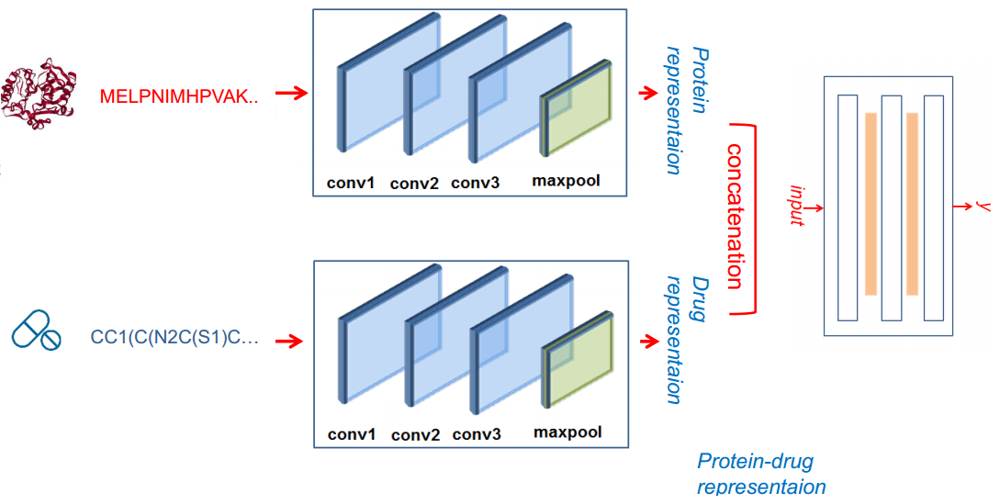

# Drug-Target Interaction: DeepDTA

### 1. Description
Drug-target interaction is a substantial research area in the field of drug discovery. It refers to predict the binding
affinity between the given chemical compounds and protein targets. In this example we train a standard DeepDTA model as 
baseline in open BindingDB datasets. BindingDB is a public, web-accessible database of measured binding affinities.

### 2. DeepDTA
DeepDTA is the modeling of protein sequences and compound 1D 
representations with convolutional neural networks (CNNs). The whole architecture of DeepDTA is shown below.



### 3. Datasets
We introduce **three datasets** from BindingDB distinguished with different affinity measurement metrics 
(**Kd, IC50 and Ki**). They are acquired from Therapeutics Data Commons (TDC), which is a collection of machine learning 
tasks spread across different domains of therapeutics.

**Dataset statistics** (# of DTI pairs, # of drugs, # of proteins): 52,284/10,665/1,413 for Kd, 991,486/549,205/5,078 
for IC50, and 375,032/174,662/3,070 for Ki.

This figure is the binding affinity distribution for the three datasets respectively, and the metrics values have been transformed into
log space.


### Requirements
You'll need to install the external TDC and RDKit packages for running the example codes.

```
conda install -c conda-forge rdkit
pip install PyTDC
```

### Usage
Run model for BindingDB datasets with IC50, Kd and Ki metrics respectively.
```
python main.py --cfg configs/IC50-DeepDTA.yaml
python main.py --cfg configs/Kd-DeepDTA.yaml
python main.py --cfg configs/Ki-DeepDTA.yaml
```


### Architecture